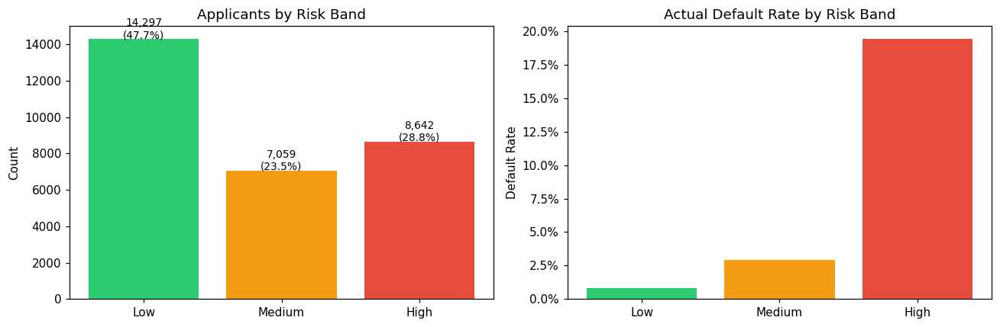
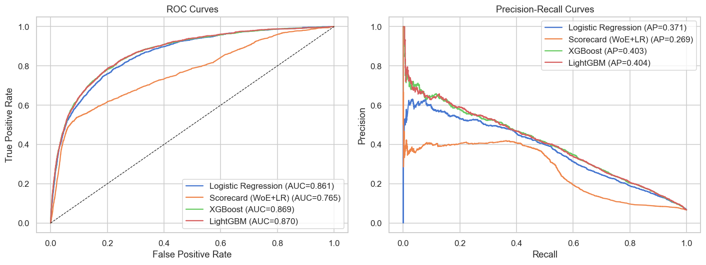
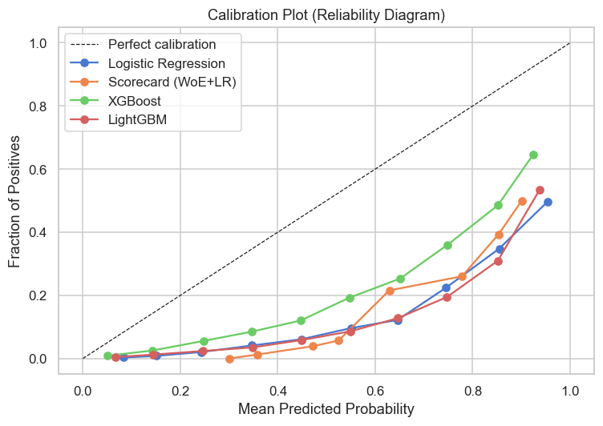
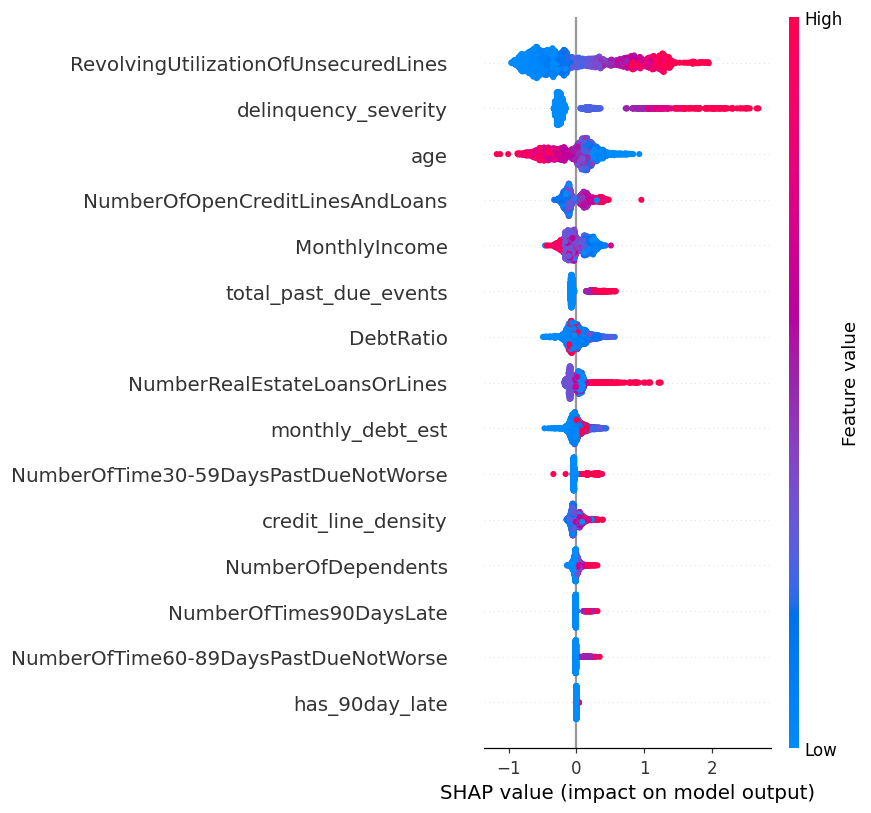
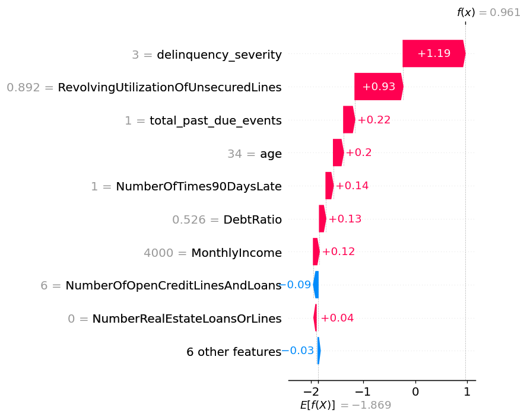

# Credit Default Risk Modeling

End-to-end credit risk modeling pipeline using the [Give Me Some Credit](https://www.kaggle.com/c/GiveMeSomeCredit) dataset (150,000 borrowers). The project mirrors real-world bank risk workflows: data extraction via SQL-style queries, baseline and advanced models, calibration analysis, SHAP explainability, and interpretable risk-band recommendations.

---

## Business Framing

> Can we identify high-risk applicants while keeping false rejections at an acceptable rate?

A model that maximizes AUC without considering **false rejection cost** is not useful in lending. This project adds:
- **Risk bands** (Low / Medium / High) with approval recommendations (Approve / Manual Review / Decline)
- **Calibration analysis** so predicted probabilities are reliable
- **SHAP explanations** for individual decisions
- **Model card** documenting limitations and intended use



---

## Dataset

| Feature | Description |
|---|---|
| `SeriousDlqin2yrs` | Target: 90+ day delinquency in 2 years |
| `RevolvingUtilizationOfUnsecuredLines` | Credit card balance / limit |
| `age` | Borrower age |
| `NumberOfTime30-59DaysPastDueNotWorse` | Past 30–59 day delinquencies |
| `DebtRatio` | Monthly debt / monthly income |
| `MonthlyIncome` | Self-reported monthly income |
| `NumberOfOpenCreditLinesAndLoans` | Total open credit lines |
| `NumberOfTimes90DaysLate` | Past 90+ day delinquencies |
| `NumberRealEstateLoansOrLines` | Mortgage / real estate loans |
| `NumberOfTime60-89DaysPastDueNotWorse` | Past 60–89 day delinquencies |
| `NumberOfDependents` | Dependents in household |

**Download data:**
```bash
pip install kaggle
kaggle competitions download -c GiveMeSomeCredit -p data/raw/
cd data/raw && unzip GiveMeSomeCredit.zip
```

---

## Project Structure

```
credit-default-risk/
├── data/
│   ├── raw/          # Original Kaggle files (gitignored)
│   └── processed/    # Cleaned feature sets (gitignored)
├── notebooks/
│   ├── 01_eda_and_preprocessing.ipynb   # Exploration, cleaning, feature engineering
│   ├── 02_modeling_and_evaluation.ipynb # LR, Scorecard, XGBoost, LightGBM, calibration
│   └── 03_explainability_risk_bands.ipynb # SHAP, risk bands, approval recommendations
├── src/
│   ├── data_processing.py   # Cleaning, imputation, outlier capping
│   ├── features.py          # WoE encoding, feature engineering
│   ├── models.py            # Model training wrappers
│   └── evaluation.py        # AUC, PR, calibration, risk band metrics
├── sql/
│   └── feature_extraction.sql   # SQL-style feature queries
├── outputs/
│   └── figures/             # Saved plots
├── model_card.md
└── requirements.txt
```

---

## Models Compared

| Model | ROC-AUC | Notes |
|---|---|---|
| Logistic Regression | 0.8607 | Baseline, fully interpretable |
| Scorecard (WoE + LR) | 0.7649 | Regulatory-friendly format |
| XGBoost | 0.8694 | Best single model |
| LightGBM | 0.8702 | Faster training, similar AUC |





### Logistic Regression

Takes all features, multiplies each by a learned weight, and sums them into a score:

```
score = w1×utilization + w2×age + w3×late_payments + ...
```

The score is passed through a logistic (S-shaped) function that squishes it into a probability between 0 and 1. The model learns by iteratively adjusting the weights to reduce prediction error. **Key limitation**: it can only draw a straight decision boundary — it misses non-linear patterns and interactions between features.

### Weight of Evidence (WoE) + Scorecard

Before fitting logistic regression, each feature is binned (e.g. age 18–24, 25–34, ...) and each bin is replaced by a WoE value:

```
WoE = log( % of defaulters in this bin / % of non-defaulters in this bin )
```

Positive WoE means the bin is riskier than average; negative means safer. The result is a traditional **scorecard** — each feature contributes a number of points, and you add them up to get a total risk score. Banks have used this format since the 1960s because regulators and credit officers can read it directly. The tradeoff is that binning loses information, which is why AUC is lower than the tree-based models.

### Gradient Boosted Trees (XGBoost / LightGBM)

Builds hundreds of small decision trees **sequentially**, where each tree corrects the mistakes of the previous one:

1. Fit a small tree — rough predictions, many errors
2. Measure the residuals (how far off each prediction was)
3. Fit a new tree that targets those residuals specifically
4. Add it to the ensemble with a small weight (learning rate)
5. Repeat 300 times

Each tree is weak on its own, but 300 stacked together become very powerful. The "gradient" means it uses calculus to find the direction that reduces error most efficiently at each step. Unlike logistic regression, it automatically discovers complex interactions — e.g. high debt ratio is only risky *if* income is also low *and* there are recent late payments. **SHAP** is used to reverse-engineer each feature's contribution after the fact, since the learned parameters are embedded in tree structure rather than explicit weights.

---

## Model Output

Every model outputs a **probability** for each borrower — a number between 0 and 1 representing the predicted chance they will default:

```
borrower_1 → 0.03   (3% chance of default)  
borrower_2 → 0.67   (67% chance of default)  
borrower_3 → 0.12   (12% chance of default)  
```

This is what `predict_proba()` returns. Everything else is built on top of that number.

**Step 1 — evaluate the probabilities** using metrics that compare predicted probabilities against actual outcomes:

| Metric | What it measures | Score (XGBoost) |
|---|---|---|
| ROC-AUC | Can it rank defaulters above non-defaulters? 0.5 = random, 1.0 = perfect | 0.8694 |
| Avg Precision | When it flags risk, how often is it right? Baseline (random) ≈ 0.067 | 0.49 |
| Brier Score | Are the probabilities accurate? 0.0 = perfect, lower is better | ~0.07 |

**Step 2 — convert probabilities into a risk band and lending recommendation:**

| Predicted Probability | Risk Band | Recommendation |
|---|---|---|
| < 10% | Low | Approve |
| 10% – 25% | Medium | Manual Review |
| ≥ 25% | High | Decline |

Sample decision report from notebook 03:

```
age  MonthlyIncome  Utilization  predicted_prob  risk_band  recommendation  actual_default
 45     5400.0         0.21          0.04          Low        Approve              0
 27     2800.0         0.88          0.71          High       Decline              1
 52     8200.0         0.03          0.02          Low        Approve              0
```

---

## SHAP Explainability

XGBoost gives a borrower a 73% default probability — but why? The model has 300 trees and 15 features, so you can't just read it like an equation. **SHAP** (SHapley Additive exPlanations) reverse-engineers the answer by assigning each feature a contribution value for every single prediction.

For a high-risk borrower it might look like:

```
Base rate (avg default rate)         →  +6.7%
NumberOfTimes90DaysLate = 3          →  +38%
RevolvingUtilization = 0.95          →  +21%
age = 24                             →  +8%
MonthlyIncome = $1,800               →  +5%
DebtRatio = 0.2                      →  -4%
NumberOfDependents = 0               →  -2%
                                     --------
Final predicted probability          →  73%
```

Positive values pushed the score up (more risky), negative values pushed it down (less risky). Add them all up and you get the final prediction.





### Three plots generated in notebook 03

**Summary plot** — shows every feature across 2,000 sampled borrowers. Each dot is one borrower, colored red (high feature value) or blue (low). Reveals patterns like "high utilization always increases default risk."

**Bar chart** — ranks features by average absolute impact across all borrowers. `NumberOfTimes90DaysLate` is typically the single most important feature in credit scoring.

**Waterfall plot** — explains one specific borrower. Shows exactly which features made them high or low risk, and by how much.

### Why it matters for banking

Regulators and rejected applicants have a legal right to know why they were declined (FCRA / Regulation B). SHAP gives a defensible, feature-level explanation for every decision — which is why it has become standard in bank model validation (SR 11-7 guidance).

---

## Key Outputs

- ROC and Precision-Recall curves (all models)
- Calibration plots (reliability diagrams)
- SHAP summary and waterfall plots
- Risk band distribution and approval rate table
- Model card with limitations

---

## Setup

```bash
git clone https://github.com/YOUR_USERNAME/credit-default-risk.git
cd credit-default-risk
pip install -r requirements.txt
# Download data (see above), then:
jupyter notebook
```

Run notebooks in order: `01` → `02` → `03`.
